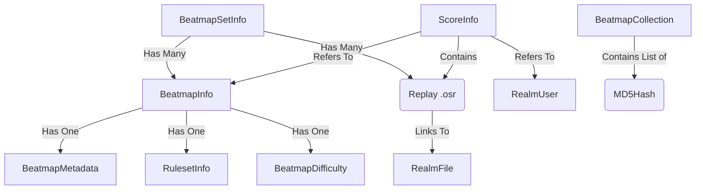

# osu!lazer Database Schema Documentation for Plugin Developers

This document describes the structure of the `client.realm` database used by osu!lazer. It is intended for plugin developers who need to interact with the database directly or via their own local Realm instance, without needing to reference the game's source code.

**Schema Version:** 51 (as of writing)
**Database Type:** Realm (.NET)

## 1. Concepts & Storage Logic

- **Object-Based**: Relations are direct object references (e.g., `BeatmapInfo.BeatmapSet`), not foreign key IDs (mostly).
- **File Storage**: Files are not stored as blobs in the DB. They are stored on disk in the `files/` directory. The DB maps a "Filename" (virtual) to a "File Hash" (physical file on disk).
- **Soft Delete**: Many core objects (`BeatmapSetInfo`, `ScoreInfo`, `SkinInfo`) have a `DeletePending` boolean. If true, the object is marked for deletion and should be ignored by queries.
- **JSON Serialization**: Complex structures like Mods and Statistics are often stored as JSON strings within a single column to simplify the schema.

---

## 2. Core Models (Tables)

### Beatmaps (Maps & Songs)

#### `BeatmapSetInfo` (The "Song")

Represents a folder containing one or more difficulties.

- `ID` (Guid, PrimaryKey): Unique internal ID.
- `OnlineID` (int, Indexed): ID on osu.ppy.sh (`-1` if local).
- `DateAdded` (DateTimeOffset): When imported.
- `Status` (int): Ranked status (0=Locally Modified, 1=Ranked, etc.).
- `Hash` (string): A composite hash of **all** `.osu` files in the set (ignores images/audio).
- `DeletePending` (bool): Soft delete flag.
- **Relationships:**
  - `Beatmaps` (List<`BeatmapInfo`>): List of difficulties.
  - `Files` (List<`RealmNamedFileUsage`>): All files attached to this set (mp3, jpg, osu, sb).

#### `BeatmapInfo` (The "Difficulty")

Represents a single `.osu` file.

- `ID` (Guid, PrimaryKey): Unique internal ID.
- `OnlineID` (int, Indexed): ID on osu.ppy.sh.
- `MD5Hash` (string): MD5 of the specific `.osu` file content.
- `OnlineMD5Hash` (string): MD5 expected by the server (used for update checking).
- `StarRating` (double): Cached star difficulty (Note: Attribute details like Aim/Speed are NOT stored).
- `DifficultyName` (string): e.g., "Insane".
- `AudioLeadIn` (double): Delay before audio starts.
- `StackLeniency` (float): Stacking behavior.
- `EpilepsyWarning` (bool): Manual flag.
- _Hidden/Ignored properties_: `CircleSize`, `ApproachRate`, etc. are stored in `Difficulty` (embedded object), not flat columns.
- **Relationships:**
  - `BeatmapSet` (`BeatmapSetInfo`): Parent set.
  - `Metadata` (`BeatmapMetadata`): Artist/Title info.
  - `Ruleset` (`RulesetInfo`): Game mode (osu, taiko...).

#### `BeatmapMetadata`

Shared metadata for a beatmap (or set).

- `Title`, `TitleUnicode` (string).
- `Artist`, `ArtistUnicode` (string).
- `Source` (string).
- `Tags` (string): Space-separated tags.
- `Author` (`RealmUser`): Mapper info.
- `AudioFile` (string): Filename of the audio track.
- `BackgroundFile` (string): Filename of the background image.
- **Note**: There are NO specific columns for Thumbnails or Covers. They are generated from `BackgroundFile`.

---

### File System

#### `RealmFile`

Represents a physical file on disk (deduplicated).

- `Hash` (string, PrimaryKey): SHA-2 hash of the file content.
- **Storage Location**: `files/{first_character}/{second_character}/{Hash}`.

#### `RealmNamedFileUsage`

Links a filename to a physical file.

- `File` (`RealmFile`): Reference to the physical file.
- `Filename` (string): Virtual name (e.g., "bg.jpg").

---

### Scoring

#### `ScoreInfo`

Represents a replay or score.

- `ID` (Guid, PrimaryKey): Unique ID.
- `OnlineID` (long, Indexed): ID on server.
- `TotalScore` (long): Standardized score (classic/lazer scoring mixed).
- `TotalScoreWithoutMods` (long): Raw score.
- `MaxCombo` (int).
- `Accuracy` (double): 0.0 to 1.0.
- `RankInt` (int): Grade (SS, S, A...).
- `Date` (DateTimeOffset): When played.
- `PP` (double?): Performance Points.
- **Serialized Data:**
  - `ModsJson` (string): List of active mods (e.g., `["DT", "HD"]`).
  - `StatisticsJson` (string): Hit results (300s, 100s, Misses). `Dictionary<HitResult, int>`.
  - `MaximumStatisticsJson` (string): Theoretical max hits.
- **Relationships:**
  - `BeatmapInfo` (`BeatmapInfo`): Map played.
  - `RealmUser` (`RealmUser`): Player info.
  - `Files` (List<`RealmNamedFileUsage`>): Replay data (`.osr`).

---

### Skins

#### `SkinInfo`

- `ID` (Guid, PrimaryKey).
- `Name` (string).
- `Creator` (string).
- `InstantiationInfo` (string): System type if it's a default skin (e.g., "Argon").
- `Protected` (bool): True for default skins (cannot be deleted).
- **Relationships:**
  - `Files` (List<`RealmNamedFileUsage`>): Skin elements (textures, sounds).

---

### Collections

#### `BeatmapCollection`

User-created collections (folders).

- `ID` (Guid, PrimaryKey).
- `Name` (string).
- **Important**: `BeatmapMD5Hashes` (List<`string`>) is used instead of object references.
  - This allows a collection to contain maps that are not currently installed (orphaned references).
  - To find maps in a collection, you must query `BeatmapInfo` where `MD5Hash` is in this list.

---

### Rulesets & Input

#### `RulesetInfo`

- `ShortName` (string, PrimaryKey): `osu`, `taiko`, `fruits`, `mania`.
- `OnlineID` (int): 0, 1, 2, 3.
- `Available` (bool): Is the ruleset plugin loaded?

#### `RealmKeyBinding`

- `ID` (Guid, PrimaryKey).
- `RulesetName` (string): Null for global bindings.
- `KeyCombinationString` (string).
- `ActionInt` (int): Integer representation of the action enum.

---

## 3. Relationships Diagram (Simplified)

## 4. Workflows for Plugin Devs

**Finding a File path:**

1. Get `BeatmapSetInfo`.
2. Find `RealmNamedFileUsage` in `BeatmapSetInfo.Files` where `Filename == "bg.jpg"`.
3. Read `RealmNamedFileUsage.File.Hash` (e.g., `abc123...`).
4. Path on disk: `files/a/b/abc123...`.

**Protecting Integrity:**

- You CAN modify `BeatmapSetInfo.Files` (add/remove items).
- You CANNOT safely modify `BeatmapInfo.MD5Hash` (it must match `.osu` content).
- Ideally, do not delete `BeatmapInfo` directly; set `DeletePending = true`.

**Checking Updates:**

- Compare `BeatmapInfo.MD5Hash` (Local) vs `BeatmapInfo.OnlineMD5Hash` (Server).

**Collections:**

- Collections do not update automatically if a map hash changes. If you modify a map's `.osu` file, you must update its entry in collections manually (remove old hash, add new hash).
